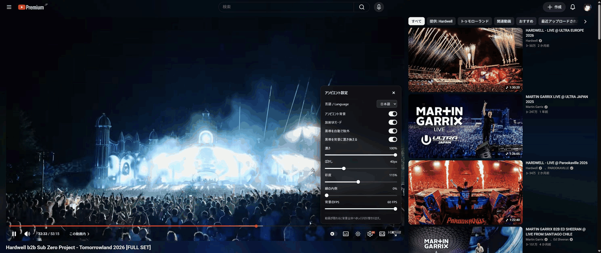

# YouTube Ambient Canvas

YouTubeの動画の色をページ全体の背景へ広げる、MITライセンスの拡張機能です。
YouTubeやGoogleとは関係のない独立したプロジェクトです。

## ダウンロード

Chrome Web Store版：公開後、この欄にストアの直接リンクを追加します。

Firefox AMO版：公開後、この欄にストアの直接リンクを追加します。

審査前の開発版は[GitHub Releases](https://github.com/REZERV-Amaghini/youtube-ambient-canvas/releases)からChrome用・Firefox用ZIPを取得できます。
([Chrome用ZIP](https://github.com/REZERV-Amaghini/youtube-ambient-canvas/releases/download/v0.2.2/youtube-ambient-canvas-chrome-0.2.2.zip) /
[Firefox用ZIP](https://github.com/REZERV-Amaghini/youtube-ambient-canvas/releases/download/v0.2.2/youtube-ambient-canvas-firefox-0.2.2.zip))
Chromeは展開して「パッケージ化されていない拡張機能」として読み込みます。
Firefoxの永続インストールにはAMOの署名が必要です。

GitHub Releasesの配布パッケージは0.2.2です。開発ソースとローカルのChrome／Firefox用
ビルドは0.2.23で、Enhancer for YouTubeなどとの互換修正を検証中です。
両ストアには0.2.17を提出済みです。現在の審査結果・公開状態は再確認していません。

## 機能

- 動画の縁の色を放射状に伸ばし、動画以外のページ背景に反映。
- 動画が半分隠れた位置から動画全体の背景へ徐々に混ざり、見えなくなると
  移行が完了。上へ戻すと放射状へ戻ります。
- 移行に合わせて背景の光を抑え、画面外では設定した濃さの45%にします。
  文字を読みやすくし、上へ戻すと元の濃さへ復帰。スライダー値は保持します。
- 放射状／動画全体の切り替え、ぼかし・濃さ・彩度・縁の内側の調整。
  開発版0.2.18では、スクロールで動画が画面外になると、ぼかし幅を設定値の半分へ
  滑らかに切り替えます。下限は25px、上へ戻すと設定値へ戻ります。
- 背景のFPSは24〜60で調整でき、初期値は30FPS。設定はローカル保存。
- 開発版0.2.16では共有・保存などのボタン、絞り込み、検索欄、Enhancerのツールバーを
  暗い半透明の共通配色に統一。色・通常／ホバー／選択時の濃さ・ぼかしは
  `ambient.css` 冒頭の `--yac-control-*` 変数で一括調整できます。
  初期の濃さは通常22%・ホバー34%・選択中44%です。
  開発版0.2.20では、その濃さを保持し、ボタンの背後の明るさを文字色に合わせて補正します。
  `--yac-control-backdrop`で補正を一括調整。Enhancerは明るいアイコンに合わせた暗い補正を使います。
  検索欄の枠を保持し、入力中は枠を強調します。
  開発版0.2.23では、操作ボタン・検索欄・Enhancerの通常時の背景補正を明るくしました。
  絞り込みタグと矢印、チャットなどの読む面の濃さは保持します。
  設定パネルはYouTubeの設定に近い半透明のダーク背景。
- 対称な黒帯の自動除外と、黒帯を背景に置き換えるスイッチ。
- 開発版0.2.12では黒帯を320×180で検出し、圧縮ノイズ・小さな字幕やロゴ・境界の揺れを考慮。
  動画の表示サイズを保ち、背景の色採取には別の160×90画像を使います。
  採色と表示の境界を分け、検出できた帯内の明るい字幕・ロゴを表示側に残します。
  背景の色計算・描画は専用Workerへ分離し、YouTube側の半透明表示と設定操作はページ側に残します。
- 開発版0.2.17では、透明化の対象を必要な変更時だけ同期し、通常のコメント追加で
  ページ全体を再走査しません。非表示タブの走査と、Worker待ち中の位置計算も停止します。
  対応ブラウザでは動画フレームの通知を使い、同じ映像の重複採取を減らします。
  警告の監視は背景FPSと独立して継続。画像の取得・表示とCSSの合成はページ側に残ります。
- 開発版0.2.18では、背景の投影をWorker内のWebGL2シェーダーで描画します。
  GPU未対応・初期化失敗・コンテキスト消失時は同じWorker内の2D描画へ戻ります。
  黒帯検出・警告の採色と、YouTubeの透過スタイルは従来の処理を維持します。
- 開発版0.2.22では、警告用の画素をWorkerから返す際の余分なコピーを省きます。
  背景・監視が不要な間や映像の読込待ちは、表示更新ごとに同じUI処理を繰り返しません。
  採色解像度とぼかしの設定は保持します。実際のコメント読込速度は未計測です。
- 歯車の隣の丸いアイコンから設定。暗いモノクロのパネルが動画プレーヤー内の
  右下、操作ボタン列の上に開きます。×または同じアイコンで閉じます。
  開発版では背景をオフにしても設定は開いたままです。小さいプレーヤーではパネル内をスクロールできます。
- 日本語／英語の切り替えと保存。設定名・説明・アイコンの案内も切り替わります。
- 開発版0.2.19では、埋め込みライブチャットとプレイリストの読む面を64%の半透明にします。
  ダークテーマではボタンと共通の暗い配色、ライトテーマでは白い面を使い、純正文字色を保持。
  `--yac-reading-opacity`で濃さを一括調整し、プレイリストのホバー時も読む面を維持します。
  ヘッダー・リプレイのメニュー・トップファンも同じ色とブラーを使い、背景オフで元に戻ります。
  スーパーチャット・メンバー等の色付きカードは保持します。
- 開発版0.2.12では、高速点滅が約3秒続いたときに暗い警告を最前面に表示。
  動画と背景はそのまま続きます。「濃さを下げる（15%）」と「二度と表示しない」を
  選べ、詳細設定から警告を再度オンにできます。検出や15%の濃さは安全を保証しません。
  背景オフ・全画面でも警告の採色監視を続け、設定変更は開いている別タブへ反映します。
- 開発版0.2.21では、設定の保存に失敗すると設定画面と警告内に再試行を表示します。
  そのページで選んだ値は維持し、15%への変更を自動で戻しません。
  警告の操作が全画面プレイヤーへ伝わる経路も止めています。
- 設定はローカル保存のみ。追跡・外部通信・実行時依存はありません。

## 開発版のインストール

Python 3.9以降で`python scripts/build.py`を実行します。

**Chrome 109以降／Chromium:** `chrome://extensions`でデベロッパーモードを
オンにし、Load unpackedで`dist/chrome`を指定。更新後はYouTubeを再読み込み。
旧版を読み込んでいる場合は、先に旧版をオフにして二重に読み込まないように
してください。Codexの埋め込みブラウザに旧版がキャッシュされている場合も、
拡張機能を最新版から再読み込みしてください。

**Firefox 140以降:** `about:debugging#/runtime/this-firefox`のLoad Temporary
Add-onから`dist/firefox/manifest.json`を指定。一時アドオンは再起動で外れます。

ルートのマニフェストはFirefox向けです。ビルドでChrome用の固有項目を生成
します。提出ZIPでは`manifest.json`が直下にあります。

## ビルドとテスト

実装は読みやすいJavaScriptとCSSです。ビルドにnpm依存のインストールは不要。
`npm run check`で構文検査、`npm run demo`で自作のテスト映像を表示できます。
`npm run test:flash`は数値データだけで点滅検出を検査し、点滅映像は表示しません。
`npm run test:bars`は黒帯の境界と誤検出、`npm run test:worker`は古い画像の破棄・設定変更・終了処理を確認します。
`npm test`は投影のRGBA一致、複数タブの設定同期、実コントローラーのOFF・全画面・seek・終了処理も検査します。
`?warning-demo&store`では点滅させずに警告の操作と保存を確認できます。
`/warning-check`では実コントローラー・Worker・ネイティブダイアログの連携、
全画面、保存失敗・再試行・再読み込みを確認できます。映像は静止状態を保ち、
検出器だけに数値データを渡すため、実動画での検出精度や時間を証明するものではありません。
`/gpu-check`では静止画でGPUと2Dの採色・クロップ・Worker連携・復帰動作を比較します。
このページの処理時間は動画取得・転送・CSSブラー・YouTubeを含む速度ではありません。
表示されたlocalhost URLへアクセスし、`?bars`で黒帯、`?chat`でチャットを追加してください。
DevToolsで`tests/check-renderer.js`を実行すると描画とスクロール計算を検査
できます。`/firefox-check`は同じ検査を画面に表示します。

`python scripts/build.py`はChrome・Firefox・ソース・ストア素材のZIPと
SHA-256一覧を`dist/`に生成します。明示したファイルだけを梱包し、キャッシュ、
プロファイル、個人情報を含むキャプチャは除外します。PNGアイコンは同梱済み。

## 制約

対象はデスクトップYouTubeの動画ページです。全画面ではページ背景を停止。
保護動画は描画できない場合があります。ピクセル読み取りが禁止された場合は
端の描画へ切り替わり、自動黒帯検出は使えません。「縁の内側」で手動調整
できます。真っ暗なシーンは誤ってクロップしないよう判定を抑えています。

色の採取は160×90、背景更新は24〜60FPSで調整できます。実際の更新頻度は
画面のリフレッシュレートと動画・端末の性能にも制限されます。ぼかしと画面合成の負荷は
ブラウザ・GPU・画面サイズに依存します。動画、文字、ボタン、サムネイルは
前面に保持します。チャットの本文は読み取り・送信しません。

開発版のWorkerは処理中の画像を1件に制限し、遅れた画像を待ち行列へ追加しません。
起動や画像転送が使えない場合は従来のCanvas描画へ戻ります。黒帯は320×180の
標本から推定するため元動画の全画素精度ではなく、同じ黒色の映像と帯の境界など
見分けられない場面も残ります。実際の負荷とChrome・Firefox拡張での動作は追加確認が必要です。

[プライバシー](PRIVACY.md)・[公開手順](docs/PUBLISHING.md)・
[ストア説明](docs/LISTING.md)・[対応候補](docs/TARGETS.md)・
[検証結果](docs/VALIDATION.md)・[残る品質確認](docs/QUALITY-GATES.md)

実際のYouTubeでの動作例です。映像はHardwellの動画を使用しています。

## English

A local ambient background for YouTube watch pages, with radial edge projection,
smooth scroll blending, black-bar detection and replacement, and customizable
blur, opacity, saturation and background frame rate (24–60 FPS, default 30).
The background automatically dims as the video scrolls away. Translucent settings
open inside the player, with Japanese/English language selection. Embedded chat
reading surfaces are translucent while ambient is enabled. No tracking or remote code.
MIT licensed.

Development 0.2.12 adds an optional rapid-flash warning, enabled by default. A
dark modal appears after about three seconds of detected rapid flashing while
playback and ambient continue. You can reduce strength to 15% or disable further
warnings; Advanced settings can re-enable them. Detection and reduced opacity
do not guarantee safety. GitHub release packages remain on 0.2.2; current development
sources and local builds are 0.2.23. Version 0.2.17 was submitted to both stores;
their current review/publication state has not been rechecked.
