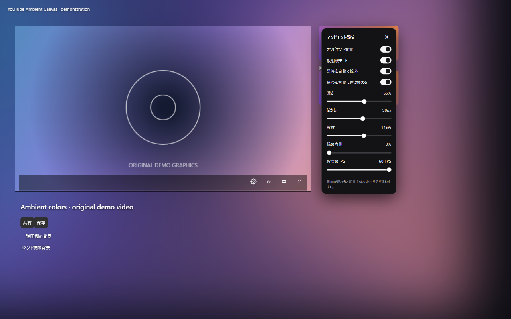

# YouTube Ambient Canvas

YouTubeの動画の色をページ全体の背景へ広げる、MITライセンスの拡張機能です。
YouTubeやGoogleとは関係のない独立したプロジェクトです。

## ダウンロード

Chrome Web Store版：公開後、この欄にストアの直接リンクを追加します。

Firefox AMO版：公開後、この欄にストアの直接リンクを追加します。

審査前の開発版は[GitHub Releases](https://github.com/REZERV-Amaghini/youtube-ambient-canvas/releases)からChrome用・Firefox用ZIPを取得できます。
([Chrome用ZIP](https://github.com/REZERV-Amaghini/youtube-ambient-canvas/releases/download/v0.2.0/youtube-ambient-canvas-chrome-0.2.0.zip) /
[Firefox用ZIP](https://github.com/REZERV-Amaghini/youtube-ambient-canvas/releases/download/v0.2.0/youtube-ambient-canvas-firefox-0.2.0.zip))
Chromeは展開して「パッケージ化されていない拡張機能」として読み込みます。
Firefoxの永続インストールにはAMOの署名が必要です。

## 機能

- 動画の縁の色を放射状に伸ばし、動画以外のページ背景に反映。
- 動画が半分隠れた位置から動画全体の背景へ徐々に混ざり、見えなくなると
  移行が完了。上へ戻すと放射状へ戻ります。
- 移行に合わせて背景の光を抑え、画面外では設定した濃さの45%にします。
  文字を読みやすくし、上へ戻すと元の濃さへ復帰。スライダー値は保持します。
- 放射状／動画全体の切り替え、ぼかし・濃さ・彩度・縁の内側の調整。
- 背景のFPSは24〜60で調整でき、初期値は30FPS。設定はローカル保存。
- 検索欄にも背景を反映。設定パネルは不透明なダーク背景。
- 対称な黒帯の自動除外と、黒帯を背景に置き換えるスイッチ。
- 歯車の隣の丸いアイコンから設定。暗いモノクロのパネルが関連動画リストに
  重なり、×、同じアイコン、または背景オフまで開いたままです。
- 設定はローカル保存のみ。追跡・外部通信・実行時依存はありません。

## 開発版のインストール

Python 3.9以降で`python scripts/build.py`を実行します。

**Chrome 109以降／Chromium:** `chrome://extensions`でデベロッパーモードを
オンにし、Load unpackedで`dist/chrome`を指定。更新後はYouTubeを再読み込み。
旧版を読み込んでいる場合は、先に旧版をオフにして二重に読み込まないように
してください。Codexの埋め込みブラウザに旧版がキャッシュされている場合も、
拡張機能を最新版から再読み込みしてください。

**Firefox 140以降:** `about:debugging#/runtime/this-firefox`のLoad Temporary
Add-onから`dist/firefox/manifest.json`を指定。一時アドオンは再起動で外れます。

ルートのマニフェストはFirefox向けです。ビルドでChrome用の固有項目を生成
します。提出ZIPでは`manifest.json`が直下にあります。

## ビルドとテスト

実装は読みやすいJavaScriptとCSSです。ビルドにnpm依存のインストールは不要。
`npm run check`で構文検査、`npm run demo`で自作のテスト映像を表示できます。
表示されたlocalhost URLへアクセスし、`?bars`で黒帯を追加してください。
DevToolsで`tests/check-renderer.js`を実行すると描画とスクロール計算を検査
できます。`/firefox-check`は同じ検査を画面に表示します。

`python scripts/build.py`はChrome・Firefox・ソース・ストア素材のZIPと
SHA-256一覧を`dist/`に生成します。明示したファイルだけを梱包し、キャッシュ、
プロファイル、個人情報を含むキャプチャは除外します。PNGアイコンは同梱済み。

## 制約

対象はデスクトップYouTubeの動画ページです。全画面ではページ背景を停止。
保護動画は描画できない場合があります。ピクセル読み取りが禁止された場合は
端の描画へ切り替わり、自動黒帯検出は使えません。「縁の内側」で手動調整
できます。真っ暗なシーンは誤ってクロップしないよう判定を抑えています。

色の採取は160×90、背景更新は24〜60FPSで調整できます。実際の更新頻度は
画面のリフレッシュレートと動画・端末の性能にも制限されます。ぼかしと画面合成の負荷は
ブラウザ・GPU・画面サイズに依存します。動画、文字、ボタン、サムネイルは
前面に保持します。ライブチャットは変更しません。

[プライバシー](PRIVACY.md)・[公開手順](docs/PUBLISHING.md)・
[ストア説明](docs/LISTING.md)・[対応候補](docs/TARGETS.md)・
[検証結果](docs/VALIDATION.md)

## English

A local ambient background for YouTube watch pages, with radial edge projection,
smooth scroll blending, black-bar detection and replacement, and customizable
blur, opacity, saturation and background frame rate (24–60 FPS, default 30).
The background automatically dims as the video
scrolls away. No tracking or remote code. MIT licensed.
